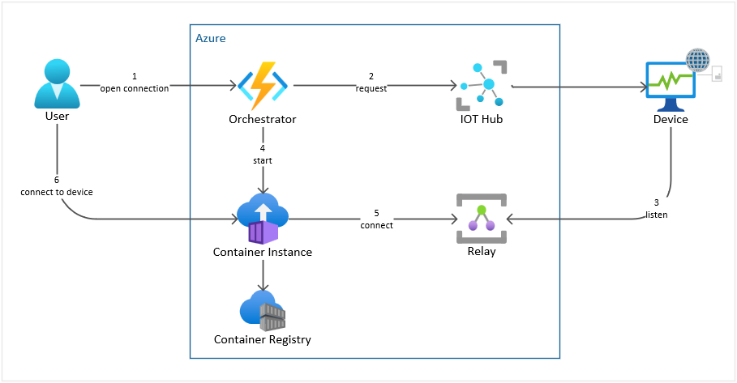
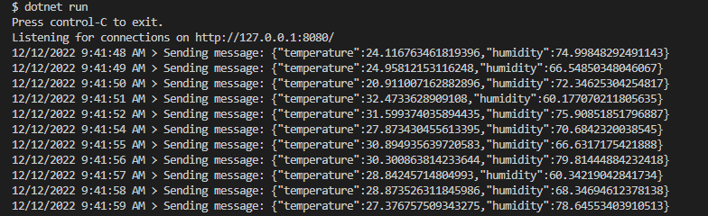
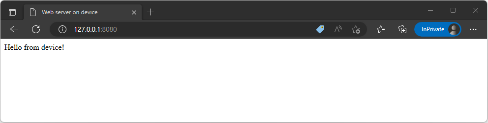
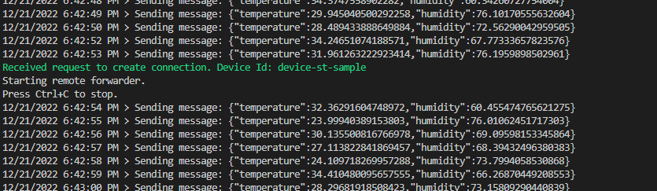
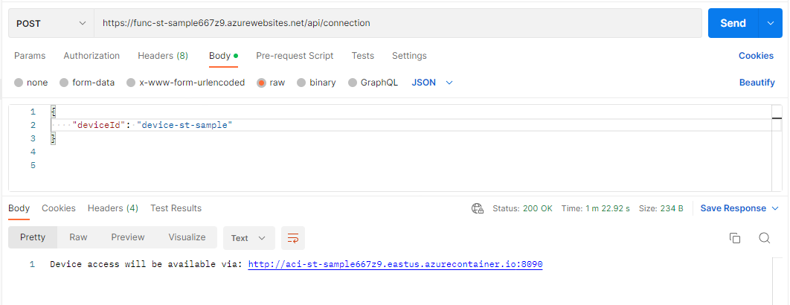
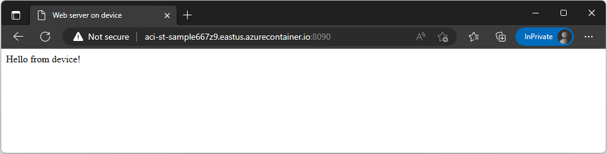

# Secure Tunneling with Azure Relay

When devices are installed at remote locations and protected by firewalls, the users who need to access them for troubleshooting or other operational tasks often need to be present on-site or connected to the same local network as the device.

Secure Tunneling enables users to establish secure, bidirectional connections to edge devices, without making significant changes to the firewall or network configuration on the edge. 

This code sample implements a Secure Tunneling solution leveraging the [Azure Relay service](https://learn.microsoft.com/en-us/azure/azure-relay/relay-what-is-it) and demonstrates how to open a connection that uses a secure tunnel between a cloud end point and a device at a remote site. The device acts as a listener that creates a [hybrid connection](https://learn.microsoft.com/en-us/azure/azure-relay/relay-hybrid-connections-protocol) with Azure Relay and waits for connection requests. An application running in the cloud can connect to the device by targeting the same hybrid connection. The cloud application then exposes a public endpoint that is accessible to users and marshalls all bytes between the user and the device through the hybrid connection. This enables communication between the user and device using any protocol that leverages TCP (this sample uses HTTP).

The flow below demonstrates how a user can access a web server that is running on a remote device in a private network.

 

1. The user triggers an Orchestrator Function to initiate a connection with a device specified in the request payload.
2. The Orchestrator invokes a direct method to the device via IoT Hub. 
    - Direct methods are synchronous, follow a request-response pattern and are meant for communications that require immediate confirmation of their result (within a user-specified timeout). 
    - The [Azure IoT service SDK](https://www.nuget.org/packages/Microsoft.Azure.Devices) is used as it contains code to interact directly with IoT Hub to manage devices.
3. The target device runs a web server and sends Telemetry to the IoT Hub. Upon initiation of a connection, it runs a Remote Forwarder for the port the web server is running on via [Azure Relay Bridge](https://github.com/Azure/azure-relay-bridge#readme) and starts listening to an Azure Relay Hybrid Connection of the same name. 
    - The [Azure IoT Hub device SDK](https://www.nuget.org/packages/Microsoft.Azure.Devices.Client) is used to receive and respond to the direct method without having to worry about the underlying protocol details. 
4. Upon successful response, the Orchestrator provisions and/or starts an Azure Container Instance (ACI) that runs a Local Forwarder via [Azure Relay Bridge](https://github.com/Azure/azure-relay-bridge#readme) configured to connect to the same Azure Relay Hybrid Connection.
5. The ACI connects to the Azure Relay Hybrid Connection and exposes a public endpoint.
6. When the connection is established, the user can access the web server that is running on the remote device by going to the ACI's fully qualified domain name (FQDN) in their browser.

## Provision resources and deploy Azure Function

1. Prerequisites

    1. [Docker](https://www.docker.com/)
    1. [Azure CLI](https://learn.microsoft.com/en-us/cli/azure/install-azure-cli) 2.4.2 or above
    1. [Azure CLI IoT extension](https://github.com/Azure/azure-iot-cli-extension#installation)
    1. [Powershell](https://learn.microsoft.com/en-us/powershell/scripting/install/installing-powershell)
    1. [.NET 6.0](https://dotnet.microsoft.com/en-us/download/dotnet/6.0)

1. Create `settings.yaml`

    ```bash
    cd deploy
    cp sample.settings.yaml settings.yaml
    ```

    set the tenantId and subscriptionId, and adjust the values for the Azure resource names by replacing `[unique-id]` with a unique identifier so that your resource names are unique across Azure.

1. Execute `provision_resources.ps1` script to:

    1. Provision the Azure resources:
 
        - Resource group
        - Azure Relay
        - IoT Hub
        - IoT Device 
        - Azure Container Registry (ACR)
        - App Service Plan
        - Azure Storage Account

    1. Build images for the Azure Function and the Local Forwarder that will run on an ACI
    1. Push images to the ACR
    1. Generate `app.config` file in the simulated-device project
    1. Generate Azure Function app settings file `azure.settings.json`
    1. Deploy Azure Function
    1. Configure Azure Function using `azure.settings.json`

    ```bash
    pwsh provision_resources.ps1
    ```

## Run the sample

### Run the Simulated Device

To start the simulated device follow these steps:

1. Confirm that during the provisioning step, the `src/simulated-device/app.config` was generated.

1. Start the Simulated device to: 

    - Send Telemetry to the IoT Hub
    - Run a web server
    - Handle direct method call to run the azure relay remote forwarder
    - Handle direct method call to stop the azure relay remote forwarder

    ```bash
    cd src/simulated-device
    dotnet run
    ```

    

1. Confirm you can access the local web server on `http://127.0.0.1:8080/`

    

### Call the Azure Function to create a connection to the device

The Azure Function supports 2 HTTP methods.

POST will:

- Call a direct method to the simulated device to create a connection.
- If successful, provision/start an ACI that runs the Azure Relay bridge for the local forwarder

DELETE will:

- Call a direct method to the simulated device to delete the connection.
- De-provision the ACI that runs the Azure Relay bridge for the local forwarder

To call the function to create a connection use Postman or curl:

```bash
curl --location --request POST "https://<your-function-name>.azurewebsites.net/api/connection" \
--header 'Content-Type: application/json' \
--data-raw '{ "deviceId": "<your-device-id>" }'
```

The call will be captured on the device logs:



Example Postman request:



Once DNS is propagated and ACI starts up (it might take a few minutes), you will be able to access the web server that is running on the device using the ACI FQDN and port number that are returned in the response. 



To call the function to delete the connection use Postman or curl:

```bash
curl --location --request DELETE "https://<your-function-name>.azurewebsites.net/api/connection" \
--header 'Content-Type: application/json' \
--data-raw '{ "deviceId": "<your-device-id>" }'
```

## Clean up resources

To clean up all the resources in Azure and delete the local images that were created during provisioning execute the `cleanup_resources.ps1` script:

```bash
cd deploy
pwsh cleanup_resources.ps1
```

## References

- [Sample code for Simulated Device (with direct method handler)](https://github.com/Azure/azure-iot-sdk-csharp/tree/main/iothub/device/samples/getting%20started/SimulatedDeviceWithCommand)
- [Sample code to invoke device direct method](https://github.com/Azure/azure-iot-sdk-csharp/blob/main/iothub/service/samples/getting%20started/InvokeDeviceMethod/Program.cs)
- [Control a device connected to an IoT hub](https://learn.microsoft.com/en-us/azure/iot-hub/quickstart-control-device?pivots=programming-language-csharp)
- [Azure Container Instances libraries for .NET](https://learn.microsoft.com/en-us/dotnet/api/overview/azure/containerinstance?view=azure-dotnet)
